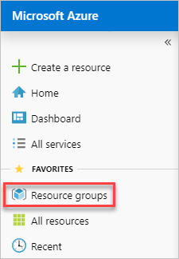
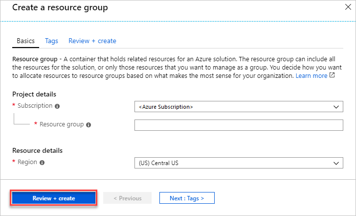
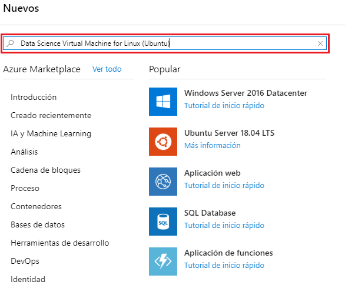
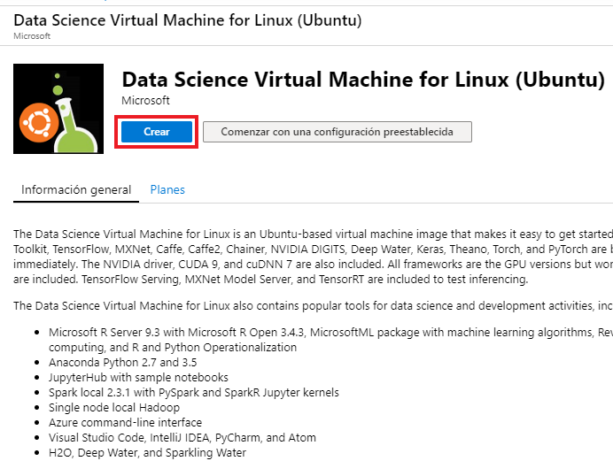
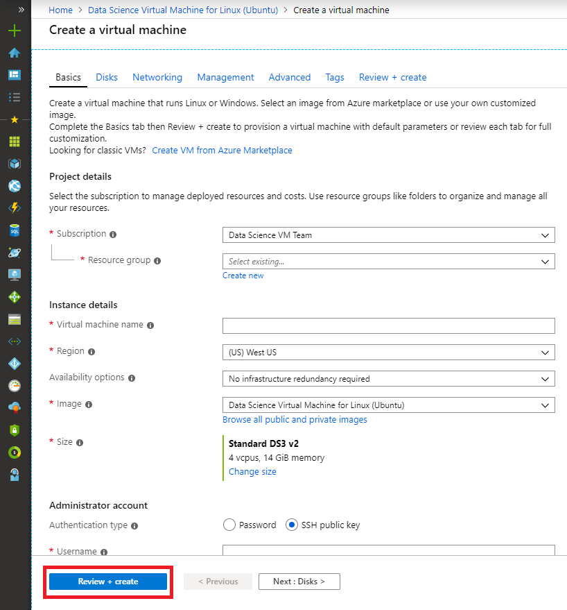
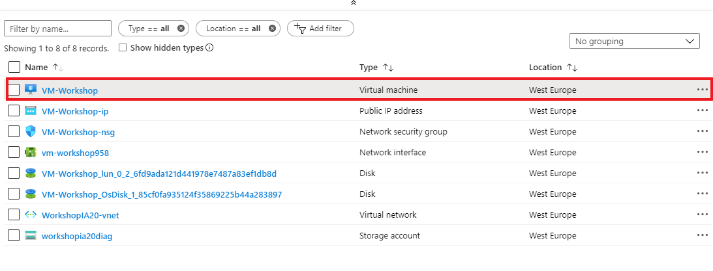

# Create your development environment

First thing first, it is necessary to set up an environment to develop this workshop. You can decide to develop the different labs, remotely or locally. The organization of this lab is as follows:

## Contents

1. [Objective](#objective)
1. [Configuration101](#configuration101)
    1. [Remote Source](#remote-source)
    1. [Local Source](#local-source)
    1. [Connection to the Environment](#connect-to-the-environment)
        1. [Remote: JupyterHub](#remote-jupyterhub)
        1. [Remote: VSCode](#remote-vscode) 
1. [Lab0: Run notebook](#lab0-run-notebook)
1. [References](#references)


## Objective 
---

The goal of this lab is to configure your own development environment for the rest of the laboratories. This environment should include:
* Python 3 version interpreter
* Access to jupyter notebooks or jupyterhub
* A python package manager (*pip*, *conda* or both)

The developer environment depends on the person and they can configured a local or a cloud base environment depending on what they are more used to. After configuring the environment you should go to section [Lab0: Run notebook](#lab0-run-notebook)

## Configuration101
---

First of all, it is necessary to create an environment for you to run the code, you are going to develop for this workshop. 
In here, two type of environments are proposed: one remote based on Azure and the other one local, for those that do not have access to a cloud account.

### Remote Source
---
A Data Science Virtual Machine is configured for the remote environment.
Before creating the remote environment, you must have an Azure subscription ([Try for free](#https://azure.microsoft.com/es-es/free/)).
> Note that *Azure free accounts* do not support GPU enabled virtual machine SKUs.

You should follow the next steps in order to configure it:

1. Go to [Azure Portal](#https://portal.azure.com/) and sign in with your Azure account if needed.
2. Create a *Resource Group* in which all the resources are going to be stored.
    1. From Azure portal, select **Resource groups**.</br>
    
    2. Then, click on **Add**.</br>
    
    3. Fill the following information:</br>
    
        * **Subscription**: Select your own azure subscription.
        * **Resource Group**: put a name for the resource group.
        * **Region**: specify an Azure location where the data and metadata is saved. 
    4. Click on **Next: Tags**. Fill upp some tags in order to help you to identify your resource group in case you have more than one.
    5. Select **Review + create**, review the values and then click on create.
3. Inside the **Resource Group** created, a *Data Science Virtual Machine* is the resource necessary to develop the different exercises.
    1. Select *Add*.</br>
    
    2. Search for *Data Science Virtual Machine for Linux (Ubuntu)* and push enter.</br>
    
    3. Select the **Create**.</br>
    
    4. You should be redirected to the "Create a virtual machine" blade.</br>
    
    5. Enter the following information:
        * *Resource group*: select the existing group already created in the previous steps.
        * *Virtual Machine Name*: give the VM a name to be created.
        * *Region*: Select the same region as the Resource Group in which the VM is going to be deployed. 
        * *Size*: select as default a Standard DS3 v2 VM. If it is not select, look for that clicking on *"Change Size"*.
        * *Authentication type*: select "Password" type. Fill the username and use a password that meets the requirements. **username** must be written in lowercase, do **not** use capitalized letters.
            > Note that
            > * If you intend to use JupyterHub, make sure to select "Password," as JupyterHub is not configured to use SSH public keys.
            > * If you use capitalized letters in your username, JupyterHub will not work, and you will encounter a 500 internal server error.
    6. Select **Review + create**, verify that all the information is correct and finally, click on **create**.

> Note that If you want to install any other library or package you could use conda or pip as follows:
> * Example of install a conda package on Ubuntu DSVM in Jupyter:
>   ``` 
>   ! sudo /anaconda/envs/py36/bin/conda install pandas -n py36 
>   ```
> * Example of install with pip in Jupyter:
>   ``` 
>   ! /anaconda/envs/py36/bin/python -m pip install --yes numpy 
>   ```

### Local Source
---

The local setup without GPU is only required in case you want to configure your local machine to execute all the Labs in your laptop.

1. First of all, please do install Anaconda in your machine

    * Windows version [here](https://repo.anaconda.com/archive/Anaconda3-2018.12-Windows-x86_64.exe).
    * Linux version [here](https://repo.anaconda.com/archive/Anaconda3-2018.12-Linux-x86_64.sh).
    * MacOS X version [here](https://repo.anaconda.com/archive/Anaconda3-2018.12-MacOSX-x86_64.pkg).

Anaconda is a free and open-source distribution of the Python and R languages. It makes easy the management of packages and their use. In addition, Anaconda comes with more than 1,500 packages as well as the *conda* package and virtual environment manager. 
> Note that Anaconda is suggested as package and virtual environment manager, but you can use other managers such as [venv](https://docs.python.org/3/library/venv.html) and [pip](https://pip.pypa.io/en/stable/). 

2. Once you have installed anaconda, now it is time to create a virtual environment with all the package necessaries:

```bash
> conda env create -f PATH_TO_FOLDER/conda_env_local.yml
```

3. Once the creation of the environment ends, the environment must be activated. The name of the environment is *aiworkshop*, in case you want to activate it manually any other time. 

```bash
> conda activate aiworkshop
```

4. Once activated the virtual environment, you only have to run the Jupyter Notebook server.

```bash
> jupyter notebook
```
> Note that the server will be initiated but you need an IDE or a modern web browser to access the notebook server.

Finally, if you want to *install any other library* you could **activate the environment** in another command prompt and uses **conda** or **pip** to install the package you needed.

### Connection to the Environment
---

Up until now, the environment has been installed but it is necessary that you connects to it from any interface. We recommend the use of a modern web browser for developing everything from the notebooks provided by jupyter.
In order to connect to your environment follow the next instructions.

#### Remote: JupyterHub

The Ubuntu DSVM runs [JupyterHub](https://github.com/jupyterhub/jupyterhub), which consists of a Jupyter server. In order to connect to it:

1. Go to the deployed DSVM in your resource group and click on it.</br>

2. Make note of the public IP address for your VM. </br>

3. Open a web browser and navigate to https://your-vm-ip:8000, replacing "your-vm-ip" with the IP address you took note of earlier.
4. Enter the username and password that you used to create the VM, and sign in. </br>

5. Upload the Labs folder, so you can have everything in the cloud.

#### Local: VSCode

In the local environment once you have initiated the jupyter notebook server, then you only to open a web browser and copy and paste the URL given by the server as in the following picture.


However, if you do not want to use a browser but some IDE tool, we recommend the use of [Visual Studio Code](https://code.visualstudio.com/) (VSCode) to develop and execute the different labs in this workshop.

1. Install **VSCode** from [here](https://code.visualstudio.com/)
2. Install the extensions [Python](https://marketplace.visualstudio.com/items?itemName=ms-python.python)
3. Connect to the local jupyter notebook server, using the URL given when opening the server. 
    1. Press in VSCode `Ctrl+Shift+P`
    2. Search for *"Python: Specify local or remote Jupyter server for connections"* and press enter.
    3. Paste the URL of the local server and you can execute your notebooks from VSCode.
    > Note that you can only connect with your local Jupyter server since the login is done by token and not user authentication.

> In order to create a blank notebook just hit `Ctrl+Shift+P` and search for *"Python: Create New blank Jupyter notebook"*.

## Lab0: Run notebook

This Lab consists of running the notebook *Lab0smoketest.ipynb*, the idea is to test that everything is well configured.

If there was no error when executing, congratulations you have passed the Labs.

If there was some errors you should, review all the steps of this Lab carefully and rerun the test.

> Note that for remote execution you should use the kernel `Python 3.6 - Azure ML`.

## References
* Create a [Resource Group](https://docs.microsoft.com/en-us/azure/azure-resource-manager/resource-group-template-deploy-portal#create-a-resource-group)
* Create a [DSVM](https://docs.microsoft.com/en-gb/azure/machine-learning/data-science-virtual-machine/dsvm-ubuntu-intro#create-your-data-science-virtual-machine-for-linux) 
* [Anaconda](https://www.anaconda.com/)
* [Virtual Environments in python](https://docs.python.org/3/library/venv.html)
* [Package Manager installer for python](https://pip.pypa.io/en/stable/)