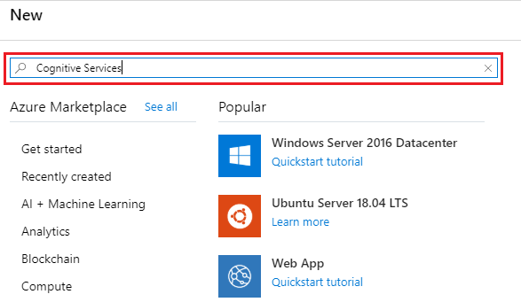
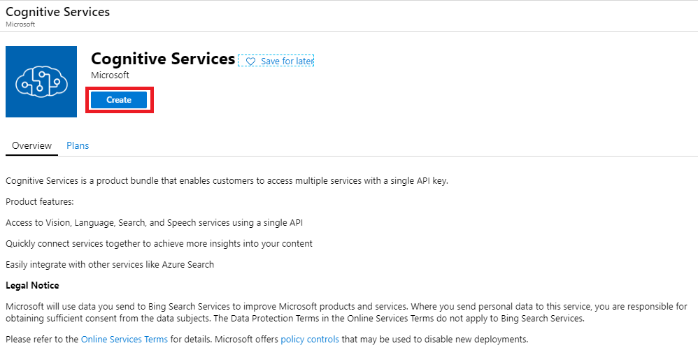

# Lab 01: Ready for Machine Learning with Cognitive Services

### Contents 

1. [Introduction](#introduction)
1. [Objective](#objective)
1. [Prerequisites](#prerequisites)
1. [Lab01 Description](#lab01-description)
1. [References](#references)

## Introduction
---

Artificial Intelligence and Machine Learning were created to help people to save time in repetitive tasks.
A couple of friends of us know that we learn some stuff of AI and they ask for some help to develop something that fits their necessities. 

Our friends are mountain lovers and they enjoy going out to the mountain whenever they have time.
Each season, they buy lots of new stuff and gear for going to the mountain and store all the mountain gear in a storage facility.
However, this year they saw that they have lots of unused gear and they wanted to sell it on the internet.
First of all, they have to make an inventory of what they owned, but they do not have time for that.

So, they want us to make a mountain gear classifier so they can detect automatically which gear they have and sell it on the internet
Thus, our Machine Learning project begin trying to help our friends in recognizing the different mountain gear that they have. 

In addition, they provide us with some photos of the catalog of mountain products from a famous e-commerce shop.
The idea is to use them so we can train and prove that our hypothesis works.
This dataset of photos consists of different categories of the things that they had bought in the past from that shop.
the file they gave us is called `dataset-images.zip` and it is inside the Lab folder.

With all this information and the clear objective of making a clothes classifier, we want to research first the built-in Azure Cognitive Services for images.
We are going to test this cognitive services using some of the photos our friends have provided us and see what can we do.

## Objective
---

In this lab, we are going to use Azure Cognitive Services to check if they can be used to classify the different items of our friends storage.
The main goal is to send some images to the Computer Vision API of Azure Cognitive Services to obtain:
* A description
* Type of object 
* Tags 
In order to obtain the necessary information to identify the different objects.

## Prerequisites
---

This Lab has the following prerequisites:
* Prepared the development environment.
* Have installed the Computer Vision Python SDK from [here](https://pypi.org/project/azure-cognitiveservices-vision-computervision/)
```bash
! pip install azure-cognitiveservices-vision-computervision
```
* Install the Azure Cognitive Services within your Resource Group.
    1. Got to the **Resource Group** you already have created previously.
    1. Click on the **Add** button.
    1. Search for **Cognitive Services**.</br>
    
    1. Click on **Create**.</br>
    
    1. Fill up the following information and press *Create*.
        * Select a proper *name*
        * Use the *subscription* given, and the *location* and *resource group* you already have.
        * Use lower *Pricing Tier* available.</br>
    
        
## Lab01 Description
---

You should use the notebook `Lab01_CognitiveServices.ipynb` to create a series of callings to the Computer Vision API through Python with the images inside the `dataset_images.zip`. 
More precisely, you should continue the notebook to fulfill the following targets:
* Unzip the image dataset.
* Obtain the number of images per category.
* Represent some of the images inside the folder.
* Create a function to send a local image and obtain:
    * description,
    * categories,
    * objects,
    * and tags,
printing them in the most appropriate way.

## References
---
* [Azure Cognitive Services](https://docs.microsoft.com/es-es/azure/cognitive-services/)
* [Computer Vision SDK](https://docs.microsoft.com/en-gb/python/api/overview/azure/cognitiveservices/computervision?view=azure-python#packages)
* [Quickstart: Azure Cognitive Services computer vision API](https://docs.microsoft.com/en-us/azure/cognitive-services/computer-vision/quickstarts-sdk/python-sdk)
* [Glob module](https://docs.python.org/3/library/glob.html#module-glob)
* [zipfile module](https://docs.python.org/3/library/zipfile.html)
* [Matplotlib library](https://matplotlib.org/)
* [Pillow library](https://pillow.readthedocs.io/en/stable/) 