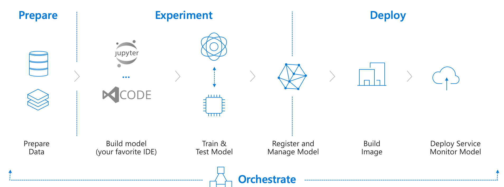

# Workshop Inteligencia Artificial - Microsoft Educación

All the labs in this workshop are prepare for the assistants to develop them in order to learn more about Artificial Intelligence, Machine Learning & Deep Learning using the tools provided by Azure.
The workshop is organized as follows:

1. [Introduction](#introduction)
2. [Organization](#organization)
    1. [Lab 0: Warm Up](#lab-0:-warm-up)
    2. [Lab 1: Cognitive Services](#lab-1:-cognitive-services)
    3. [Lab 2: Data preparation](#lab-2:-data-preparation)
    4. [Lab 3: Training Models](#lab-3:-training-models)
    5. [Lab 4: Deploy](#lab-4:-deploy)
3. [Some resources](#Some-resources)
4. [Useful links](#useful-links)

## Introduction

The main idea of the workshop is to accomplish the different steps involved in a Machine learning project using the different tools that the Azure cloud environment provide us.
The steps in which an AI project is divided are represented in the following image.

* The process will start preparing the data, doing some transformations to adjust our model.
* Then, after deciding the approach that we are going to follow, a model will be trained to solve the problem. 
To do so, you could use any tool to develop your code.
* With a satisfactory trained model, register it to keep track and store the model.
* Finally, it is necessary to make the model accessible for anyone, so a docker image is built satisfying all the dependencies and put on a webservice to be requested.

Throughout the different Labs prepared in this workshop, you will be tested to pass each of these steps and you will have to use different tools of the Azure cloud to achieve it.

## Organization

Each lab of the workshop covers different tasks to learn more about AI and some services already inside the Azure cloud.
The organization of the workshop is as follows:

### Lab 0: Warm Up

In this Lab, the initial environment setup is configured. 
You are going to prepare a local or a cloud environment in order to develop different [jupyter notebooks](https://jupyter.org/) for later labs.
Apart from the Jupyter notebooks, you are going to use [Anaconda](https://www.anaconda.com/) or any python virtual environment creation tool.
Finally, [VS Code](https://code.visualstudio.com/) is proposed as the tool to develop your notebooks.

### Lab 1: Cognitive Services

In this Lab, you are going to explore the dataset of images given in this repository. 
You are going to obtain some insights from the photos that you were given through the use of different out of the box services.
Furthermore, you are going to build your first image classification model in the cloud. 
In order to do this, you are going to use a Azure Custom Vision portal.

### Lab 2: Data Preparation

After playing with some Azure services, in this Lab you are going to prepare the data for the training of a model.

### Lab 3: Training Models

In this Lab, you are going to develop two image classifiers for our problem: a Random Forest classifier and a Convolutional Neural Network (Deep Learning) model. To achieve these models, you are going to use [Scikit-learn](https://scikit-learn.org/stable/index.html) and [Tensorflow with Keras](https://www.tensorflow.org/guide/keras).

### Lab 4: Deploy

Finally, choose one of the models in order to make it available to anyone from a webservice.

## Some resources
* [Create the free account](https://azure.microsoft.com/en-us/free/search/)
* [Azure Machine Learning Services documentation](https://docs.microsoft.com/en-us/azure/machine-learning/service/)
* [Azure Machine Learning SDK for Python documentation](https://docs.microsoft.com/en-us/python/api/overview/azure/ml/intro?view=azure-ml-py)

## Useful links

* [Microsoft Learn - Machine Learning](https://docs.microsoft.com/en-us/learn/browse/?roles=data-scientist&term=machine%20learning) - selection of training and exercises!
* [AI Business School](https://aischool.microsoft.com) 
* [Microsoft Professional Program for Artificial Intelligence track](https://academy.microsoft.com/en-us/tracks/artificial-intelligence)
* [Azure Machine Learning Notebook Samples](https://github.com/Azure/MachineLearningNotebooks)
* [Azure Machine Learning Overview](https://azure.microsoft.com/en-us/blog/azure-ai-making-ai-real-for-business/)
* [Azure Machine Learning Overview - What's new](https://azure.microsoft.com/en-us/blog/what-s-new-in-azure-machine-learning-service/)
* [Automated Machine Learning Overview](https://azure.microsoft.com/en-us/blog/announcing-automated-ml-capability-in-azure-machine-learning/)
* [Hyperparameter Tuning](https://docs.microsoft.com/en-us/azure/machine-learning/service/how-to-tune-hyperparameters)
* [Understand automated machine learning results](https://docs.microsoft.com/en-us/azure/machine-learning/service/how-to-understand-automated-ml)
* Distributed Training with [TensorFlow or Keras](https://docs.microsoft.com/en-us/azure/machine-learning/service/how-to-train-tensorflow#distributed-training) and [PyTorch](https://docs.microsoft.com/en-us/azure/machine-learning/service/how-to-train-pytorch#distributed-training)
* [AI Tools for VS Code](https://visualstudio.microsoft.com/downloads/ai-tools-vscode/)
* [PyTorch Support for Azure ML](https://azure.microsoft.com/en-us/blog/world-class-pytorch-support-on-azure/)
* [Azure Machine Learning Pipelines](https://docs.microsoft.com/en-us/azure/machine-learning/service/concept-ml-pipelines)
* [MLOps with Azure ML](https://github.com/microsoft/MLOpsPython) 
* [DevOps for AI: Deploying everywhere (Build 2018)](https://www.youtube.com/watch?v=Fo220toRwhM) 